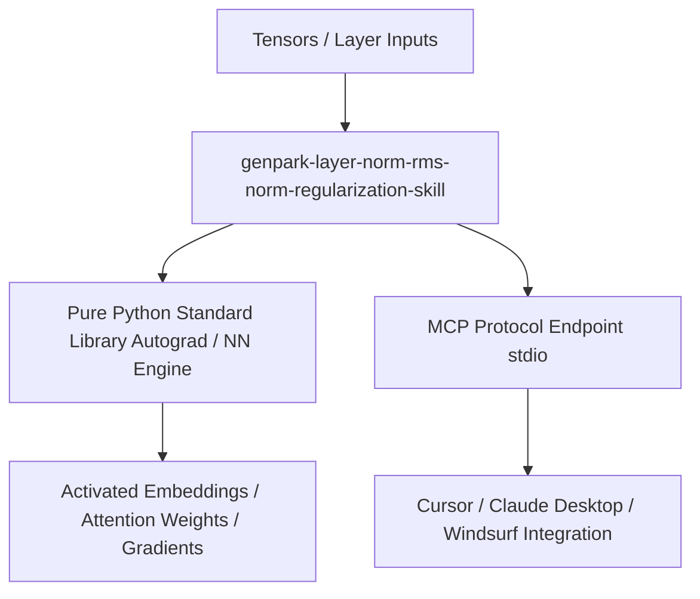

# genpark-layer-norm-rms-norm-regularization-skill

[](https://github.com/alphaparkinc/genpark-layer-norm-rms-norm-regularization-skill)
[](https://www.python.org/)
[](LICENSE)
[-brightgreen.svg)](client.py)
[](mcp_server.py)

> **LayerNorm and Root Mean Square Normalization (RMSNorm) with affine transformation parameters**

Part of the **GenPark Autonomous Agent Matrix**, developed for production AI agents implementing on-device deep learning primitives, attention blocks, and differentiable computational graphs.

---

## 🏗️ Architecture



## 🚀 Quickstart

### Native Python Execution
```bash
python example_usage.py
```

### Standard Library Verification
```python
from client import *
```

### MCP Server (Claude Desktop / Cursor)
```json
{
  "mcpServers": {
    "genpark-layer-norm-rms-norm-regularization-skill": {
      "command": "python",
      "args": ["-m", "genpark_layer_norm_rms_norm_regularization_skill.mcp_server"]
    }
  }
}
```

## 📄 License
MIT License.
